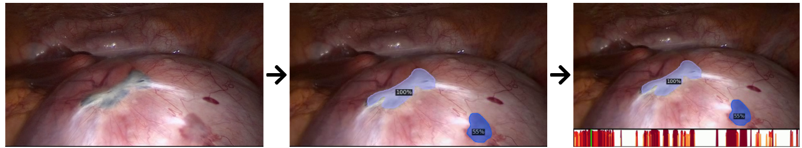

# EndometriosisSegmentationTool

Tool for segmenting endometrial implants in laparoscopic surgery videos.

### Overview

Demonstrating partial results of ongoing thorough studies on endometriosis segmentation, this web-based demo provides a user with the tools for segmenting endometrial implants in laparoscopic surgery videos. Following figure provides an overview of the tool's processing approach:



1. First a user provides the tool with an input video
2. The video is analyzed using one of several provided segmentation models
3. The analyses are utilized to additionally add a summarization bar that indicates frame-by-frame averaged segmentation confidences, while also marking the current video position.

### Citation

We kindly ask you to cite following papers if you include our work in your research:

_Post-surgical Endometriosis Segmentation in Laparoscopic Videos_

```
@article{DBLP:journals/mta/LeibetsederSKK22,
  author    = {Andreas Leibetseder and
               Klaus Schoeffmann and
               J{\"{o}}rg Keckstein and
               Simon Keckstein},
  title     = {Endometriosis detection and localization in laparoscopic gynecology},
  journal   = {Multim. Tools Appl.},
  volume    = {81},
  number    = {5},
  pages     = {6191--6215},
  year      = {2022},
  url       = {https://doi.org/10.1007/s11042-021-11730-1},
  doi       = {10.1007/s11042-021-11730-1},
  timestamp = {Thu, 03 Mar 2022 09:23:23 +0100},
  biburl    = {https://dblp.org/rec/journals/mta/LeibetsederSKK22.bib},
  bibsource = {dblp computer science bibliography, https://dblp.org}
}

@inproceedings{DBLP:conf/cbmi/LeibetsederSKK21,
  author    = {Andreas Leibetseder and
               Klaus Schoeffmann and
               J{\"{o}}rg Keckstein and
               Simon Keckstein},
  title     = {Post-surgical Endometriosis Segmentation in Laparoscopic Videos},
  booktitle = {18th International Conference on Content-Based Multimedia Indexing,
               {CBMI} 2021, Lille, France, June 28-30, 2021},
  pages     = {1--4},
  publisher = {{IEEE}},
  year      = {2021},
  url       = {https://doi.org/10.1109/CBMI50038.2021.9461900},
  doi       = {10.1109/CBMI50038.2021.9461900},
  timestamp = {Tue, 29 Jun 2021 17:37:02 +0200},
  biburl    = {https://dblp.org/rec/conf/cbmi/LeibetsederSKK21.bib},
  bibsource = {dblp computer science bibliography, https://dblp.org}
}
```

### Installation

**Requirements**

- [Python 3.8.2](https://www.python.org/downloads/release/python-382/)

  Install on system or optionally create and activate virtual environment:

  - via [Anaconda](https://anaconda.org/)

    ```
    conda create --name EndometriosisSegmentationTool python=3.8.2
    conda activate EndometriosisSegmentationTool

    ```

  - via [Python](https://www.python.org/)

    ```
    python -m venv /path/to/virtual/envs/EndometriosisSegmentationTool
    source /path/to/virtual/envs/EndometriosisSegmentationTool/bin/activate
    ```

- [CUDA 10.2](https://developer.nvidia.com/cuda-10.2-download-archive) for capable [Nvidia GPUs](https://developer.nvidia.com/cuda-gpus) (optional)
  Follow installation instructions for your particular OS.
- [PyTorch>=1.6.0 and TorchVision>=0.7.0](https://pytorch.org/get-started/previous-versions/) (optionally for CUDA 10.1)
  - using conda:
    ```
    conda install pytorch==1.6.0 torchvision==0.7.0 cudatoolkit=10.2 -c pytorch
    ```
  - using pip:
    ```
    python -m pip install torch==1.6.0 torchvision==0.7.0
    ```
- [Detectron2 v0.4](https://github.com/facebookresearch/detectron2/releases/tag/v0.4)
  use pre-built files (Linux only) or extract to any folder and build:
  ```
  python -m pip install -e detectron2-0.4
  ```
  **Hint**: Although Windows 10 is not officially supported, building should work anyways. If problems occur, please refer to [https://github.com/conansherry/detectron2/issues/2](https://github.com/conansherry/detectron2/issues/2).
- Required Python packages
  ```
  python -m pip install -r requirements.txt
  ```

**Models**

Pre-trained models can be downloaded from the [ENdometrial Implants Dataset (ENID) Homepage](http://ftp.itec.aau.at/datasets/ENID/) or [Zenodo page](10.5281/zenodo.4570969).

### Usage

```
python demo.py -h
```

```
usage: demo.py [-h] -i IN -m MODEL [-o OUT]

optional arguments:
  -h, --help            show this help message and exit
  -i IN, --in IN        path to video or input folder containing videos
  -m MODEL, --model MODEL
                        path to input model or root folder containing multiple model subfolders with their
                        respectie config.yaml files
  -o OUT, --out OUT     path to output folder (default: [IN_PATH]_out)
```

### Django Application

For ease of use a Python Django Application provides graphical UI for analyzing single videos.

#### Setup

Make sure `cfg.sh` is set up to include the correct path to Python 3.x (aliases do not work in bash files).

```
./setup_django_app.sh
```

#### Run Server

```
./run_django_app.sh
```

**Optional**: to run tool using a specific GPU device (e.g. `1`) set following environment variable:

```
CUDA_VISIBLE_DEVICES=1 ./run_django_app.sh
```

#### Clear App

**WARNING**: this will clear the database and remove all previously conducted analyses.

```
./clear_django_app.sh
```
